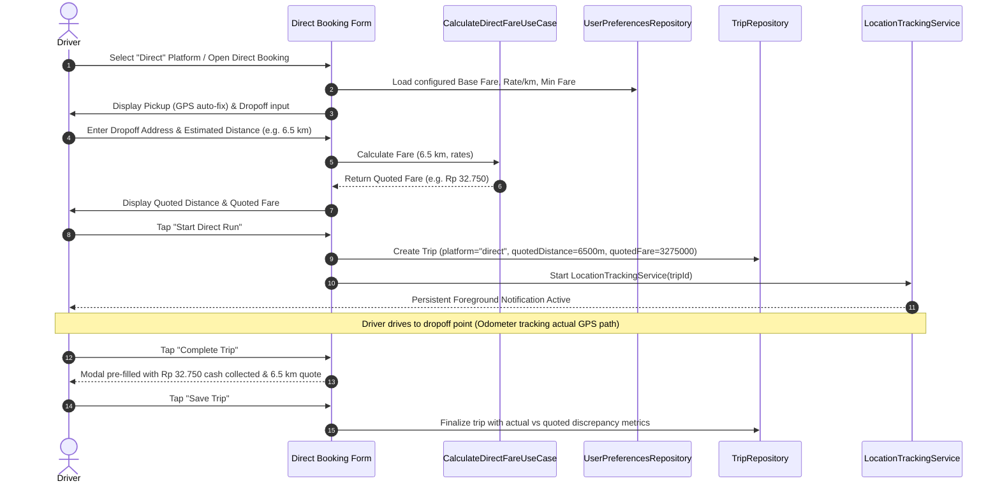

# OnTheRoad: Direct Booking & Fare Estimator (PRD)

> **Document Status**: Approved Target (user-confirmed 2026-09-23)  
> **Lifecycle**: Approved PRD; Units 1–3 complete; Unit 4 approved and in progress  
> **Tracker Issue**: [RON-277](https://linear.app/rons-space/issue/RON-277/phase-0-and-2-product-discovery-and-prd-direct-booking-and-fare)  
> **Parent Project**: [OnTheRoad: Direct Booking & Fare Estimator](https://linear.app/rons-space/project/ontheroad-direct-booking-and-fare-estimator-e09b7af9c69f)  
> **Author**: Antigravity Pair & Project Owner  
> **Date**: 2026-09-01  
> **Target Platform**: Android (Kotlin + Jetpack Compose)  
> **Target Milestone**: v0.2.0  

---

## 1. Problem Statement & Cost of Delay

Gig and independent drivers (rideshare, courier, and local delivery operators) frequently encounter direct customer requests—commonly referred to as "offline runs," "street hails," or "on-the-spot bookings"—where customers arrange a trip directly without going through platform apps (Grab, Gojek, Uber, Lalamove).

In these offline scenarios:
1. **Lack of Instant Quotation Tool**: Drivers do not have an immediate in-app tool to calculate an honest, fair price. They either guess arbitrary prices, perform mental arithmetic while negotiating, or switch back and forth between navigation apps (to check distance) and calculator apps.
2. **Underestimated Road Mileage & Lost Margin**: When quoting a flat price off the top of their head, drivers often underestimate actual road distance, detours, and heavy traffic, leading to uncompensated fuel, wear-and-tear, and time loss.
3. **Disconnected Tracking Workflow**: Once an offline trip begins, drivers have no streamlined way to track the run against the initial quote, compare actual odometer mileage with estimated kilometers, and record the direct cash/transfer earnings into their daily shift balance.

### Cost of Inaction / Delay
Without an integrated offline booking and quoting tool, drivers either undercharge direct clients and lose money, overcharge and lose repeat direct clientele, or fail to record offline earnings in their daily shift reconciliation.

---

## 2. Evidence & Grounding

- **Direct Driver Workflows**: Independent and multi-app drivers in Southeast Asia and global markets regularly supplement app gigs with private courier runs and direct return trips. Direct bookings represent 15–35% of daily net income for seasoned drivers.
- **Mental Accounting Overhead**: Drivers negotiate offline fares under time pressure while sitting in traffic or at pickup points. An automated quoting calculation that takes <15 seconds directly reduces cockpit friction.
- **Baseline Capabilities**: OnTheRoad v0.1.0 established the pure Kotlin domain model (`ARCH-001`), persistent foreground GPS tracking (`LocationTrackingService`), and discrepancy calculation (`CalculateDiscrepancyUseCase`). Extending this architecture to support upfront quote generation seamlessly leverages existing tracking infrastructure.

---

## 3. Users & Personas

### Primary Persona: Rudi ("The Independent & Hybrid Driver")
- **Role**: Full-time driver who uses gig platforms during peak hours and takes direct/offline bookings from regular clients, local businesses, and street passengers during lulls.
- **Context**: Phone mounted on car dashboard or motorcycle handlebars. Needs to quote a price to a customer standing beside the vehicle or messaging via WhatsApp/SMS within 15 seconds.
- **Goal**: Enter pickup and dropoff locations, get instant distance and recommended fare based on preset custom rates, tap "Start Run", and let OnTheRoad track actual ground truth.

### Non-Users / Excluded Personas
- **Automated Dispatch Networks**: Fleet dispatchers or taxi dispatch centers requiring centralized server dispatching.
- **End-Customer Riders**: Customers booking rides from their own phones (OnTheRoad is 100% driver-owned and cockpit-operated).

---

## 4. Vision & Core Capabilities

**OnTheRoad Direct Booking & Fare Estimator** provides an instant, offline-capable quotation and booking engine built directly into the tracking cockpit:

1. **Direct Booking Mode in Cockpit**:
   - 1-tap toggle into Direct/Offline Booking mode.
   - Origin location defaults to current GPS coordinates (with reverse-geocoded address and manual text override).
   - Destination address input with geocoded coordinates or manual km override.
2. **Automated Distance Estimation**:
   - Geocoded coordinate distance calculation (Haversine spherical distance) multiplied by an urban road detour factor (default 1.25x).
   - Instant manual distance adjustment for drivers who already know the exact road kilometer count.
3. **Dynamic Fare Pricing Engine**:
   - Calculation formula: `QuotedFare = Max(MinimumFare, BaseFare + (Max(0, EstimatedKm - IncludedBaseKm) * RatePerKm))`.
   - 1-tap manual fare override if driver negotiates a custom lump-sum with the customer.
4. **Configurable Rate Settings**:
   - Dedicated Settings section for driver rates:
     - Base Fare (e.g. `Rp 10.000` / `$3.00`)
     - Rate per Kilometer (e.g. `Rp 3.500/km` / `$1.50/km`)
     - Minimum Fare (e.g. `Rp 15.000` / `$5.00`)
     - Included Base Distance (e.g. `1.0 km` before per-km rate applies)
5. **Seamless Cockpit Run Transition**:
   - Tapping **"Start Direct Run"** immediately creates an active trip with `platformId = "direct"`, quoted distance, and quoted fare, and begins high-accuracy GPS tracking.
   - At trip completion, the modal pre-populates the quoted fare and distance, computing real-time uncompensated mileage discrepancies and profitability metrics.

---

## 5. Success Metrics

| Metric | Target | Measurement Method |
|---|---|---|
| **Quotation Speed** | < 15 seconds from opening booking to viewing price | Usability / interaction timing |
| **Calculation Accuracy** | 100% deterministic against configured pricing rules | JVM Unit test suite |
| **Tracking Transition** | 0 ms delay / 1 tap from quotation to active GPS service | Service start callback |
| **Offline Privacy & Stability** | 0 external network requests for pricing; 100% local persistence | Network profiler & Room DB audit (`SEC-001`) |

---

## 6. Functional Requirements (MoSCoW)

### Must Haves (P0 — Core Delivery)
- **`FR-DIR-01` [Rate Configuration Storage]**: Driver can configure and persist `Base Fare`, `Rate per Km`, `Minimum Fare`, and `Included Base Km` in Settings via `UserPreferencesRepository`.
- **`FR-DIR-02` [Pure Kotlin Fare Calculation Engine]**: Domain use-case `CalculateDirectFareUseCase` that computes the exact fare and chargeable distance from distance and rate parameters with zero Android framework dependencies (`ARCH-001`).
- **`FR-DIR-03` [Direct Booking Entry Interface]**: Clean cockpit UI allowing entry of pickup address, destination address, and estimated distance with live calculated fare display.
- **`FR-DIR-04` [Manual Price & Distance Override]**: Driver can manually edit the estimated distance (km) or override the calculated fare before starting the run.
- **`FR-DIR-05` [Instant Start Transition]**: Tapping "Start Direct Run" persists the initial quote (`quotedDistanceMeters`, `quotedFare`) into `Trip` and launches `LocationTrackingService`.
- **`FR-DIR-06` [Direct Fare Finalization]**: Trip completion modal pre-fills the expected fare into cash collected / direct payment field and records final discrepancy metrics.

### Should Haves (P1 — Usability Enhancements)
- **`FR-DIR-07` [Quick Origin GPS Acquisition]**: 1-tap button in booking form to snap pickup location to current live GPS coordinates and street address.
- **`FR-DIR-08` [Configurable Road Detour Factor]**: Ability to adjust the straight-line to road distance multiplier in advanced settings (default 1.25x).

### Could Haves (P2 — Future Enhancements)
- **`FR-DIR-09` [Multi-Vehicle Rate Profiles]**: Saved rate presets (e.g. "Car / Passenger" vs "Motorcycle / Courier").
- **`FR-DIR-10` [Digital Receipt Generator]**: 1-tap shareable direct receipt image for the customer.

### Won't Haves (Explicit Anti-Goals for v0.2.0)
- Remote cloud fare dispatching or external API server dependency.
- In-app digital credit card processing (cash/direct transfer only).
- Turn-by-turn routing navigation engine.

---

## 7. Critical User Flow (Cockpit Journey)

---

## 8. Technical Feasibility & Architectural Boundaries

1. **Pure Kotlin Domain Layer (`ARCH-001`)**:
   - `DirectPricingRates` data class in `core:model`.
   - `CalculateDirectFareUseCase` and `EstimateDistanceUseCase` in `core:domain`.
   - Zero Android SDK imports; 100% JVM unit testable.
2. **Data & Preferences Layer**:
   - `UserPreferencesRepository` extended with rate configuration flow (`DirectPricingRates`) backed by `SharedPreferences` in `core:data`.
3. **Presentation & ViewModels (`UI-001`)**:
   - `SettingsViewModel` extended with rate management actions.
   - `TrackerViewModel` extended with direct booking state (`DirectBookingUiState`) and fare calculation updates.
   - Compose components in `core:ui` following Material 3 tokens and Cockpit sizing guidelines.

---

## 9. Delivery map

The repository-wide governance phases are defined once in
[`docs/governance/GOVERNANCE.md`](../../../docs/governance/GOVERNANCE.md). This feature uses
implementation units for its approval and delivery boundaries:

- **Unit 1 — Quote contract and completion handoff**: `COMPLETE` in PR #8; GitHub Android CI,
  governance CI, and CodeRabbit passed on the merged revision.
- **Unit 2 — Permission and address fallback**: `COMPLETE` in PR #9; Android JVM tests, lint,
  and governance CI passed on the merge revision.
- **Unit 3 — Validated rate editing and UI acceptance**: complete in PR #11; JVM tests, lint,
  governance, and Pixel 7 Pro / API 35 UI acceptance passed on merged `dev` revision
  `a8ba7c87b06f62cb6e3f54525d741c891a65276d`.
- **Unit 4 — Configurable profiles and shareable direct receipt**: approved on 2026-09-23;
  includes `FR-DIR-08`, `FR-DIR-09`, and `FR-DIR-10`; implementation and exact-revision CI are
  in progress from `dev` tip `7cbb0d3335e5e3dfaaa708a389687265086b7843`; tracked by Linear
  issue [`RON-385`](https://linear.app/rons-space/issue/RON-385/phase-4-unit-4-direct-pricing-profiles-and-shareable-receipts).

---

## 10. Approval & Next Gate

- [x] **Product Foundation**: Grounded in real driver offline booking workflows and verified with project owner.
- [x] **Invariants Respected**: Pure Kotlin domain (`ARCH-001`), offline privacy (`SEC-001`), JVM unit testing (`TEST-001`), UDF Compose (`UI-001`).
- [x] **Tracker Linked**: Connected to Linear Issue [RON-277](https://linear.app/rons-space/issue/RON-277/phase-0-and-2-product-discovery-and-prd-direct-booking-and-fare) and Project.
- [x] **Project Owner Approval**: Explicitly confirmed in the active task on 2026-09-23.

**Next Action**: Unit 4 is approved and active, with FR-DIR-08/09/10 included. Repository governance
phases are project-wide lifecycle gates; feature implementation slices are tracked as units.
Promotion to `main` is not authorized. GitLab review-mirror cleanup is deferred and is not a
delivery gate.
