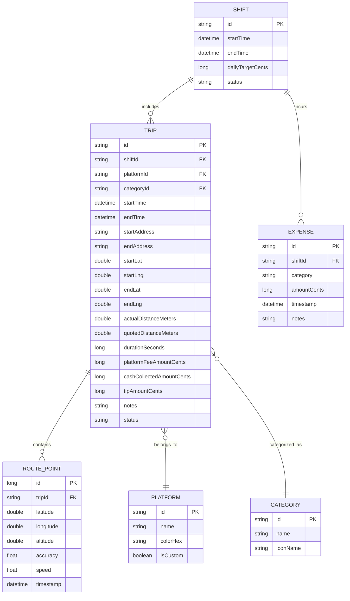

# OnTheRoad: Trip & Profitability Tracker (PRD)

> **Document Status**: Approved Target  
> **Lifecycle Phase**: Phase 2 (Product Discovery and PRD)  
> **Author**: Antigravity Pair & Project Owner  
> **Date**: 2026-08-27  
> **Target Platform**: Android (Kotlin + Jetpack Compose)  
> **Target Milestone**: MVP (Phase 3 through Phase 9)  

---

## 1. Problem Statement

Rideshare, food delivery, and gig courier drivers operate on thin margins where actual vehicle operating costs (fuel, wear and tear, deadhead mileage) directly determine take-home pay. Commercial gig platforms quote idealized distances and arbitrary base fares, frequently underestimating actual road distance (detours, traffic rerouting, complex pickup/dropoff navigation) by 500 meters to several kilometers per trip.

Drivers currently lack a fast, private, distraction-free tool to record ground-truth driving metrics, compare actual odometer mileage against platform quotes, and reconcile dual-income cash flows (digital in-app balances vs. cash collected in hand). Existing commercial tracker apps are closed-source, monetize driver mobility data, drain battery life with erratic background trip detectors, and lock basic analytics behind recurring subscriptions (\$10/month).

Without an honest, driver-centric odometer and profit tracker, drivers waste hours driving uncompensated mileage and cannot objectively determine which platforms, routes, or trip types are truly profitable.

---

## 2. Evidence

- **Direct Driver Experience**: Solo and peer rideshare drivers observe consistent discrepancies between platform quoted trip distances and actual odometer readings (e.g. driving 500m to 2km further than the gig app's estimate without compensation).
- **Dual Income Fragmentation**: Cash-in-hand transactions (cash fares, cash tips) create daily mental accounting overhead, making it difficult to distinguish immediate spendable pocket cash from delayed digital bank transfers.
- **Cockpit Safety & Friction**: Commercial apps require multi-step navigation and attention that cannot be safely performed while operating a vehicle. Interaction during driving must strictly require under 1 minute total.
- **Market Vacuum**: Beloved open-source Android finance applications ([Cashew](https://github.com/jameskokoska/Cashew), [Ivy Wallet](https://github.com/Ivy-Apps/ivy-wallet)) proved high demand for offline-first, beautiful, privacy-centric financial tracking, but are unmaintained and provide zero GPS or mobility tracking. Commercial alternatives (Gridwise, Stride, MileIQ) sell user mobility data to third parties.

---

## 3. Proposed Solution

**OnTheRoad** is a native, offline-first Android trip and earnings tracker built with Kotlin and Jetpack Compose. It delivers a fast, cockpit-safe workflow (<1 minute total interaction per trip):

1. **Cockpit Tracker**:
   - **Start Trip (1 tap)**: Instant GPS origin acquisition with address reverse-geocoding (and manual override). Phone goes into pocket/mount.
   - **Active Run**: Ultra-reliable Android Foreground Service recording elapsed time, accurate cumulative distance (with traffic-stop jitter suppression), and GPS breadcrumbs.
   - **End Trip (1 tap)**: Instant GPS destination acquisition and a single rapid modal to record: Platform digital fee, cash collected, platform quoted distance, service app tag, and trip category.
2. **Discrepancy & Profitability Engine**:
   - Compares actual driven distance vs. platform quoted distance (highlighting uncompensated mileage).
   - Computes real operational efficiency metrics: Net Earnings per Kilometer (`$/km` or `Rp/km`) and Net Earnings per Hour (`$/hr`).
3. **End-of-Shift Intelligence**:
   - **Shift Milestone & Share Card**: Daily target progress, active driving hours, trip count, and a 1-tap privacy-safe shareable graphic receipt.
   - **Cash Reconciliation**: Exact breakdown of cash in hand vs. digital app balances, with quick fuel/toll expense deductions.
   - **Trip Efficiency Leaderboard**: Trips ranked by profitability (`$/km`) to build driver routing intuition.
   - **Route Playback Map**: Interactive map displaying GPS route breadcrumbs and stopover markers.
4. **Data Privacy & Extensibility**:
   - 100% local SQLite/Room database with zero cloud telemetry.
   - Architectural foundation designed to naturally expand into a complete personal finance and budget manager (fulfilling the Cashew/Ivy Wallet legacy).

---

## 4. Key Hypotheses

1. **The Discrepancy Value Hypothesis**:  
   We believe that highlighting the explicit difference between actual odometer distance and platform quoted distance will expose uncompensated driving and enable drivers to optimize route selection and trip acceptance. We will know we are right when active drivers review the discrepancy card on 90%+ of logged trips.
2. **The Cockpit Usability Hypothesis**:  
   We believe that keeping total interaction time strictly under 1 minute (1-tap start, 1-tap end, rapid-entry modal) will eliminate app abandonment during busy multi-stop driving shifts. We will know we are right when drivers log 5+ consecutive trips in a single shift without missing trip starts.
3. **The Organic Growth Hypothesis**:  
   We believe that generating a clean, privacy-safe shift achievement receipt will encourage drivers to share their results with peer drivers at charging stations, coffee shops, and driver meetups. We will know we are right when organic driver-to-driver referrals become the primary distribution vector.

---

## 5. What We Are NOT Building (Explicit Anti-Goals)

To preserve laser focus on the MVP trip tracker, the following are strictly out of scope for v1:

- **Automatic Background Trip Detection**: No battery-draining passive geofencing or automatic drive detection that guesses when a trip starts. All trips are explicitly started and stopped by the driver.
- **Gig App Reverse Engineering / Screen Scraping**: No automated background scraping or accessibility abuse against proprietary apps (Grab, Gojek, Uber). All earnings and platform quotes are input via simple rapid numeric fields.
- **Cloud Backend & Mandatory User Accounts**: No remote server dependencies, no login screens, and no cloud synchronization. All data is owned 100% locally on the device.
- **Full Personal Banking Sync**: No Plaid or bank API integrations. General finance tracking is deferred to post-MVP roadmap phases.
- **Turn-by-Turn Navigation**: OnTheRoad is not a navigation app (Google Maps, Waze, or OsmAnd handle navigation). OnTheRoad runs passively in the background recording ground truth.

---

## 6. Target Users & Personas

### Primary Persona: The Multi-Platform Gig Driver ("Alex")
- **Role**: Full-time or side-hustle driver operating across multiple services (e.g. Grab rides, Gojek food delivery, ShopeeFood, or Uber/Lyft).
- **Context**: Driving a car or motorbike in dense urban traffic with phone mounted to dashboard/handlebars.
- **Pain Point**: App platforms deduct commissions and quote idealized straight-line or algorithmically compressed distances. Alex doesn't know if a \$6 trip that required 6km of real driving in heavy traffic was actually worth taking.
- **Goal**: Quickly record fares and cash tips without looking away from the road for more than 5 seconds, and view an honest daily profit summary before heading home.

### Secondary Persona: The Independent Courier / Direct Driver ("Rudi")
- **Role**: Peer-to-peer courier or private driver providing point-to-point delivery for direct clients.
- **Context**: Charges customers directly in cash or bank transfer; needs accurate distance logs and receipts to bill clients honestly.
- **Goal**: Export monthly mileage and earnings logs (CSV/JSON) and verify distance travelled.

---

## 7. Success Metrics

### Primary Metrics
- **Trip Log Completion Rate**: >95% of initiated trips successfully reach completed status with recorded fare data.
- **Average Interaction Duration**: <30 seconds to start a trip; <45 seconds to finalize end-of-trip fare details.
- **Shift Review Frequency**: Active drivers view the Shift Summary / Discrepancy screen at the conclusion of 100% of recorded shifts.

### Quality & Operational Invariants
- **Battery Consumption**: <3% battery usage per active hour of GPS tracking.
- **Zero Data Loss**: 100% trip state preservation across app process death, low-memory kills, or device reboots.
- **Privacy Standard**: Zero external network calls or tracking telemetry (`SEC-001`).

---

## 8. User Journeys

### Journey 1: The Active Trip (Cockpit Flow)
1. **Pickup**: Driver accepts an order on their gig platform. Driver opens OnTheRoad, taps the large **"Start Trip"** button.
2. **Auto-Acquisition**: The app acquires current GPS coordinates, reverse-geocodes the street address, initiates the Foreground Service with a persistent notification, and starts the trip timer. Driver mounts phone and begins driving.
3. **Transit**: GPS location points are periodically captured, filtered for jitter, and appended to the active route polyline. Cumulative distance and elapsed time update live.
4. **Dropoff**: Driver reaches destination, parks, and taps **"Complete Trip"** (from the in-app screen or directly from the notification action).
5. **Rapid Finalization Modal**:
   - Dropoff address is auto-populated via GPS.
   - Driver inputs Platform Digital Fee (e.g., `25000` or `12.50`).
   - Driver inputs Cash Collected, if any (e.g., `5000` or `5.00`).
   - Driver inputs Platform Quoted Distance (e.g., `4.2` km).
   - Driver selects Service Tag (e.g., `Grab`) and Category (e.g., `Food`).
   - Driver taps **"Save Trip"** (total modal time: <20 seconds).
6. **Instant Feedback**: The trip receipt card flashes the result: *"Actual: 4.8 km (+0.6 km discrepancy) | Net Rate: \$3.65/km | Profitability: High"*.

### Journey 2: End-of-Shift Reconciliation & Milestone
1. At the end of the shift, the driver opens the **Shift Summary** dashboard.
2. Driver sees:
   - **True Profitability Card**: Total gross earnings, total km driven vs total quoted km, average `$/km`, and average `$/hr`.
   - **Shift Milestone Card**: Progress toward daily goal (e.g. `115% of $120 goal in 6.4 hours`). Driver taps "Share" to export a clean graphic card to share with friends.
   - **Pocket Cash Reconciliation**: Displays physical cash collected vs digital earnings. Driver taps "Add Shift Expense", enters `$15` for gasoline. App instantly updates net take-home pay.
   - **Leaderboard**: Driver reviews the day's trips sorted by `$/km`, noticing that midday parcel runs earned 40% more per kilometer than peak-hour passenger trips.

---

## 9. Functional Requirements (MoSCoW)

### Must Haves (P0 — MVP Baseline)

- **`FR-TRK-01` [Start/Stop Odometer]**: User can start, pause, resume, and complete a trip with 1 tap.
- **`FR-TRK-02` [Persistent Foreground Tracking]**: GPS tracking runs in an Android Foreground Service with a persistent notification displaying live distance, elapsed time, and a "Complete Trip" action button.
- **`FR-TRK-03` [GPS Jitter Suppression]**: Location updates filter out stationary jitter (speed < 0.5 m/s or accuracy > 20m) to ensure accurate cumulative distance measurement.
- **`FR-TRK-04` [Address Geocoding & Manual Override]**: Automatic reverse-geocoding of start and end locations to readable street addresses using Android's native `Geocoder`, with instant fallback to manual text editing.
- **`FR-TRK-05` [Rapid Fare & Metadata Entry]**: End-of-trip modal capturing: Platform Fee, Cash Collected, Platform Quoted Distance, Platform Tag, and Trip Category.
- **`FR-TRK-06` [Discrepancy Calculation]**: Automatic calculation and visual display of the discrepancy between tracked distance and platform quoted distance (e.g. `+0.7 km` uncompensated).
- **`FR-TRK-07` [Efficiency Metrics]**: Automatic calculation of Gross Earnings per Kilometer (`$/km`) and Gross Earnings per Active Hour (`$/hr`).
- **`FR-TRK-08` [Shift Summary Dashboard]**: End-of-shift view displaying:
  - Total earnings, total km, active hours, total trips.
  - Cash-in-hand vs Digital platform balance breakdown.
  - 1-tap quick expense logging (e.g. Fuel, Tolls, Parking).
- **`FR-TRK-09` [Trip History & Efficiency Ranking]**: Chronological list of trips with ability to sort/rank by profitability (`$/km`) and filter by platform/category.
- **`FR-TRK-10` [Route Breadcrumb Storage & Map View]**: Store GPS coordinate polylines for each trip and render them on an interactive open-source map view (MapLibre / OpenStreetMap).
- **`FR-TRK-11` [Settings & Localization]**: Configurable currency symbol/code (e.g., `Rp`, `$`, `€`), distance unit (`km` default), and daily earnings target.
- **`FR-TRK-12` [Local Data Export & Import]**: Backup and restore all trip and financial data to local JSON and CSV files.

### Should Haves (P1 — Fast Follow)

- **`FR-TRK-13` [Shift Milestone Share Card]**: Generate a high-contrast, privacy-safe PNG image card summarizing shift accomplishments (no private passenger addresses) for sharing on social channels / messaging.
- **`FR-TRK-14` [Multi-Stop Trips]**: Ability to add an intermediate waypoint or multiple dropoffs to a single active trip.
- **`FR-TRK-15` [Deadhead Mileage Tracking]**: Dedicated toggle for "Empty / Return Trip" miles driven between dropoff and next pickup.

### Could Haves (P2 — Phase Expansion)

- **`FR-FIN-01` [Full Personal Finance Engine]**: Accounts, category budgeting, recurring expenses, and transfers (Cashew / Ivy Wallet expansion).
- **`FR-TRK-16` [Automatic Platform Detection]**: Heuristic detection of active gig platform via notification listening or clipboard detection.

### Won't Haves (Out of Scope for v1)

- Automatic passive background trip detection without explicit driver start.
- Cloud account sync or remote data storage.
- Turn-by-turn routing or real-time traffic navigation.

---

## 10. Non-Functional Requirements

### Performance & Battery
- **`NFR-PERF-01` [Battery Efficiency]**: Background GPS tracking must consume <3% device battery per hour on modern Android devices (Android 14+).
- **`NFR-PERF-02` [UI Responsiveness]**: Compose UI must maintain 60fps rendering without jank during active polyline drawing or history scrolling.
- **`NFR-PERF-03` [Cold Start Time]**: App cold start to interactive state in <800ms.

### Architecture & Code Health
- **`ARCH-001` [Pure Kotlin Domain]**: Domain use-cases and entity models must remain pure Kotlin with zero imports from `android.*` or `androidx.*`.
- **`UI-001` [Unidirectional Data Flow]**: All screens adhere to UDF; ViewModels expose immutable `StateFlow` and handle UI events through sealed interfaces.
- **`TEST-001` [JVM Unit Testing]**: All domain logic, calculations, and ViewModels must be 100% testable via JVM unit tests without an Android emulator.

### Security & Privacy
- **`SEC-001` [Offline Privacy Invariant]**: Trip data, GPS locations, addresses, and earnings are strictly stored in local device SQLite. No analytics, tracking SDKs, or external advertising libraries permitted.
- **`SEC-002` [Permission Transparency]**: Location permissions (`ACCESS_FINE_LOCATION`, `ACCESS_COARSE_LOCATION`, `POST_NOTIFICATIONS`, `FOREGROUND_SERVICE_LOCATION`) must be requested with clear, plain-language runtime rationale dialogues.

---

## 11. Data Model (Core Entities)

### Pre-Seeded Reference Data
- **Platforms**: `Grab`, `Gojek`, `Uber`, `Lyft`, `ShopeeFood`, `Maxim`, `Indrive`, `Lalamove`, `Direct Client`, `Other`.
- **Categories**: `Passenger Rideshare`, `Food Delivery`, `Package Courier`, `Errands / Personal`.
- **Expense Categories**: `Fuel / Gas`, `Charging`, `Toll Fee`, `Parking`, `Vehicle Wash`, `Maintenance`.

---

## 12. Edge Cases & Handling

| Scenario | System Behavior |
|---|---|
| **App Process Killed / Reboot During Active Trip** | On app relaunch or system boot, the Foreground Service checks Room DB for active `IN_PROGRESS` trips. If found, it recovers elapsed time and resumes location collection seamlessly. |
| **No GPS / Weak Signal in Tunnel or Parking Garage** | Filter rejects low-accuracy points (>25m). App retains last valid fix and uses straight-line interpolation or prompts driver to verify odometer upon exit. |
| **Offline Geocoding Failure** | If native `Geocoder` cannot resolve network addresses, the UI displays raw coordinates (`Lat: -6.20, Lng: 106.81`) and leaves the text field editable for immediate driver entry. |
| **Zero Quoted Distance Input** | Quoted distance is optional. If left blank, the app displays actual distance without generating a discrepancy alert. |
| **Multiple Trips in Single Shift** | Trips are grouped by Shift (calendar day or continuous driver session), allowing seamless daily aggregation and cash reconciliation. |

---

## 13. Phase Gate & Approval Checklist

- [x] **Problem-First**: Grounded in the observable friction and financial discrepancies of gig driving.
- [x] **Evidence-Backed**: Direct driver pain points, dual-income fragmentation, and gaps in current commercial/open-source tools.
- [x] **Falsifiable Hypotheses**: Clear measurable validation criteria for discrepancy utility and cockpit usage.
- [x] **Actionable MoSCoW**: Strict boundary between P0 cockpit odometer MVP and future personal finance expansion.
- [x] **Explicit Anti-Goals**: Background tracking, gig-app scraping, and cloud accounts explicitly excluded.
- [x] **Invariants Respected**: 100% pure Kotlin domain (`ARCH-001`), offline privacy (`SEC-001`), JVM unit testability (`TEST-001`).
