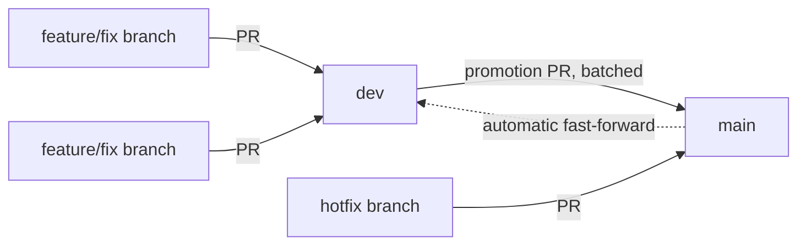

# Git Workflow

How branches, merges, and releases work in this repository, and which parts of it break things if done differently.

Three things are load-bearing, and they are the reason this document exists:

1. **Promotion pull requests must be merged with "Create a merge commit".** Squash and rebase silently destroy the ancestor property the whole model rests on.
2. **`dev` is fast-forwarded back to `main` after a promotion, automatically.** It is not a long-lived divergent branch. The sync workflow runs on every push to `main`, leaving the two branches at the same commit between promotions.
3. **GitHub is the only write and merge authority.** Any mirrors or review replicas are strictly read/review-only projections.

---

## The Shape



- `main` is the default branch and what produces releases/deployments.
- `dev` is the integration branch where day-to-day work lands.
- Batches of `dev` are promoted to `main` through a single promotion pull request.
- The dotted line is the critical synchronization: after anything lands on `main`, the sync workflow brings `dev` back up to it. In the promotion case, that is a clean **fast-forward** leaving the two at the **same commit**.

---

## The Invariant

> `dev` always contains `main`. After a promotion merge, with no new work on `dev` since, the two point at the **same commit**.

Verify parity at any time:

```bash
git fetch origin
git rev-parse origin/main origin/dev   # same SHA twice, between promotions

# The part that must hold unconditionally: main is contained in dev
git merge-base --is-ancestor origin/main origin/dev && echo ok || echo diverged
```

This is enforced by `.github/workflows/sync-dev-to-main.yml`, which runs on every push to `main`. **Do not do this by hand.**

---

## Merge Method is Load-Bearing

Promotion pull requests must be merged with **"Create a merge commit"**. Never "Squash and merge", never "Rebase and merge".

A merge commit has two parents, and one of them is the tip of `dev`. Because `dev`'s tip is an ancestor of `main`, `dev` can be **fast-forwarded** to `main`. No force push, no history rewriting, nothing discarded.

Squash and rebase both replace those commits with new SHAs that `dev` has never seen. `dev` stops being an ancestor, the fast-forward becomes impossible, and recovering requires a human and potentially a force push.

This is enforced by repository settings:
```text
allow_merge_commit  = true
allow_squash_merge  = false
allow_rebase_merge  = false
```

---

## The Sync Workflow

`.github/workflows/sync-dev-to-main.yml` runs on every push to `main` and on manual dispatch:

| State | Action |
|---|---|
| `dev` missing | Create it at `main` |
| `dev` equal to `main` | Nothing to do |
| `dev` behind `main` | **Fast-forward** `dev` to `main` (the promotion case) |
| `dev` ahead, contains `main` | Nothing to do. New work has landed on `dev` |
| Neither contains the other | Merge `main` into `dev`, keeping `dev`'s tip as first parent |
| That merge conflicts | Fail loudly and leave both branches untouched |

Properties:
- **Neither push is forced.** Git rejects anything that is not a fast-forward, so no outcome can discard a commit.
- **A rejected push is retried.** If someone pushes to `dev` between reading the tip and pushing, the workflow refetches and retries, up to 3 attempts.
- **Healing `dev` costs no extra Android CI run.** The fast-forward push uses `GITHUB_TOKEN`, preventing recursive workflow triggers.

---

## Everyday Flows

### Feature or Fix
1. Cut branch from `dev`: `git checkout dev && git pull && git checkout -b feat/my-feature`
2. Implement, test locally, commit atomically with Conventional Commits (`feat: ...`, `fix: ...`).
3. Open pull request targeting **`dev`**.
4. Pass all CI checks (governance and Android build/test).
5. Merge into `dev`.

### Promotion to Main
1. Open pull request from `dev` into **`main`** (e.g. titled `release: promote dev YYYY-MM-DD`).
2. Merge using **"Create a merge commit"**.
3. `.github/workflows/sync-dev-to-main.yml` runs and fast-forwards `dev` to `main`.
4. Both branches sit at the exact same commit.
